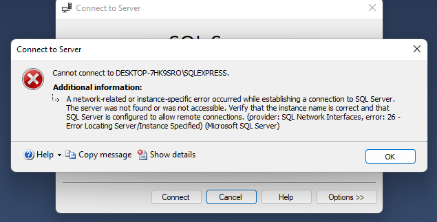
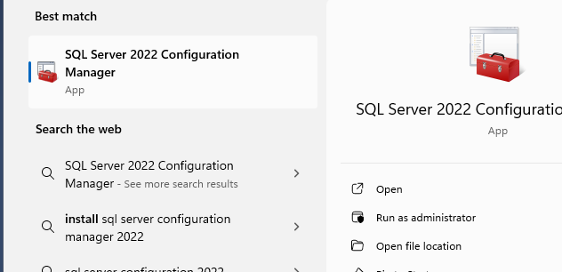
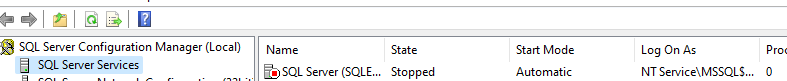
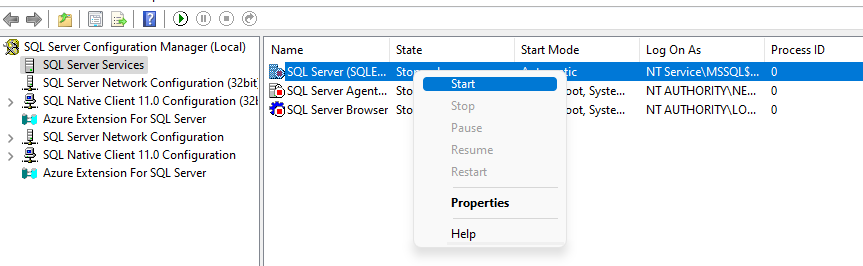
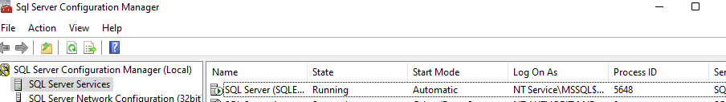
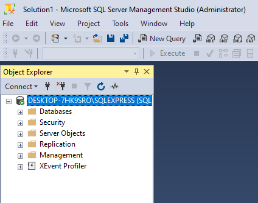

# Fixed SQLConnection Error

## Introduction: 
This document details the troubleshooting and resolution steps taken to fix a recent SQL connection error encountered while attempting to connect to SQL server.

## Error Encountered: 

## Steps Taken to Fix The Error:

1. Go to the Windows Tab and search for SQL Server 2022 Configuration Manager depending on the SQL Server Configuration Manager model you are using

   

3. Open SQL Server Configuration Manager and proceed to the SQL Server Service. If it appears stopped, like this:

   

4. Then, right-click on the service and select Start.

   
    
5. Allow it to finish loading; the status that previously showed "stopped" should now display "running".

   

6. Good One! Return to SQL Server Management Studio (SSMS) and click on connect to establish a connection to the SQL server.
   

### By following these steps, you should be able to diagnose and fix a similar SQL connection error if encountered in the future without having to reinstall the application

#### *Hope you find this helpful*

#### *The End*

